# 面向有机合成课题组的自动化核磁计算平台

### 前言

笔者目前是一位处于天然产物全合成课题组的在读博士生。在本科阶段，本科的导师时常与笔者畅想“未来的有机化学”，这一宏大愿景下的一项命题即为“计算辅助的有机化合物的结构解析”，在那时我们便设想搭建一个面向有机合成课题组的实用化的计算化学辅助的有机化合物结构解析平台。然而，在各种不可抗力的影响下，这一计划一拖再拖，尽管积累了很多素材、知识和经验，但一直到本科毕业，笔者也未能去完成这一实践。幸运的是，在研究生阶段，恰逢课题组遇到了目标分子原始结构鉴定有误的难题，笔者提出可以通过核磁计算的方式重新解析天然产物结构，最终揭示出若干个不同寻常的结构突变并得到了合成化学的印证（*J. Am. Chem. Soc.* **2025**, *147*, 33136.）。通过此次偶然的实践，笔者所处的一个传统的天然产物全合成课题组与核磁计算的工具建立起了牢靠的信任关系。事实上，在日常的合成研究中，每一步反应所得的高级中间体，其结构之复杂与精巧并不亚于天然产物本身，而计算亦从不区分人工与天然，因此这一实用的工具有望用于辅助课题组内日常对于合成中间体的结构鉴定。笔者为此重新拾起本科时期的设想，充分考虑一个忙碌的有机合成课题组的日常需求，花费了数月的构思、学习与尝试，选取了若干实用的核磁计算流程，通过将自编的批处理脚本和现有程序相结合的方式，为组内初步搭建了一套自动化核磁计算平台，实现了从输入记录化合物结构的.xyz文件到输出易于处理的数据文件的一键化计算，现将这一初步的成果和相应的使用经验与大家分享，欢迎各位批评指正。

### 1. 简介

#### 1.1 **有机合成化学家为什么需要核磁计算？**

在各种有机化学或仪器分析的教材中，我们学习了很多实用的现代技术用于有机化合物的结构表征与鉴定，如红外、拉曼、紫外、核磁、质谱、X-射线单晶衍射等。在实践中，面临一个结构待定的新有机化合物，核磁往往成为有机化学家的鉴定结构的首选。抛开技术发展和测试成本问题，笔者认为核磁成为首选的一个重要原因是其可预见性更强，即在有机化学家的知识体系下，一个给定的有机物结构对应的特征核磁信号在人脑中可以获得直观的预测，一系列预测值与实验值相吻合的自洽加强了有机化学家对结构研判无误的信心。因此，有机化学家对核磁谱图的解析能力的强弱直接取决于其预测水平的高低，而核磁计算本身就是在对核磁信号进行预测。值得注意的是，面临例如长程耦合的强弱、同类质子的化学位移的相对大小等更精细的结构信息的预测，有机化学家往往束手无策，而核磁计算总能给出答案。核磁计算能辅助有机化学家从更多的角度去发掘预测值与实验值相吻合的自洽，无疑会提高其对有机物结构的解析能力。

#### 1.2 有机合成化学家需要什么精度的核磁计算？

溶液体系中分子的行为相当复杂，通过量子化学计算研究有机化合物在溶液体系中的磁学性质固然基于一些模型、假设和近似处理。有机合成化学家追求的”高精度“核磁计算并不是要求原理上的严格和精确，而是寻求在某种处理方式下获得的预测值与实验值有一定的可比性。事实上，甚至这一可比性也可以不必关心，仅关注核磁计算如何协助自己作出判断即可。换言之，有机合成化学家真正关心的问题并不是核磁计算在数值上的准确度，而是核磁计算为有机物结构鉴定做出判断的可靠程度。因此，笔者在此选择了若干计算模块，其出发点是能通过一套标准的、成熟的计算和数据处理流程直接获取与结构鉴定相关的可靠结论，不苛求原理上的严格和精确。

#### 1.3 计算模块功能简介

##### 1.3.1 DP4+/MM-DP4+/dJ-DP4/ML-J-DP4

DP4是由Goodman课题组于2010年提出的一种概率意义的统计参数（ *J. Am. Chem. Soc.* **2010**, *132*, 12946.）。一套化学位移的实验值与多个候选结构的计算预测值相比较，每个候选结构的相对吻合程度可通过DP4概率衡量。这一参数最常见的应用情景即为非对映异构体间的结构判断。Sarotti课题组对DP4有众多改良，如DP4+（*J. Org. Chem.* **2015**, *80*, 12526.）、MM-DP4+（ *J. Nat. Prod.* **2023**, *86*, 2360.）、J-DP4（*Org. Lett.* **2019**, *21*, 4003.）、ML-J-DP4（*Org. Lett.* **2022**, *24*,  7487.）等，使其判断能力更强，应用范围更广，数据处理更简便。

DP4+相较DP4的改良在于：其标准计算流程中几何优化在B3LYP/6-31G(d)密度泛函级别下进行，获得的分子几何结构质量相较DP4方法使用分子力场MMFF94优化的结果有显著提高；核磁计算在mPW1PW91-PCM/6-31+G(d,p)密度泛函级别下进行，通过隐式溶剂模型考虑了溶剂效应；参数化过程中纳入氢化学位移的比较（DP4仅比较碳化学位移）以及实验数据标度的化学位移预测值，比较更加全面，表现更加可靠。然而，DP4+的标准计算流程使用DFT级别进行几何优化，相较分子力场方法耗时显著增加，其计算效率上相较DP4有所降低。

MM-DP4+是一种使用分子力场进行几何优化的DP4+的加速版本，其通过核磁计算级别的调整和其他参数化细节的优化实现尽可能逼近DP4+的准确度。其标准计算流程中几何优化在分子力场MMFF94下进行，核磁计算在ωB97X-D-SMD/6-31+G(d,p)密度泛函级别下进行，与经典的DP4计算效率相当，基本可以取缔DP4。

J-DP4是由一种纳入耦合常数计算与比较的DP4的改良版本。该方法分为直接法（dJ-DP4）与间接法（iJ-DP4）：直接法的标准计算流程中几何优化在分子力场MMFF94下进行，核磁计算在B3LYP/6-31G(d,p)密度泛函级别下进行，其中耦合常数计算仅考虑Fermi Contact部分，同时比较化学位移和耦合常数的实验值与预测值作出相应判断；间接法基于实验所得耦合常数换算的二面角关系对底物的构象搜索加以限制或以此为过滤条件对构象搜索的结果进行筛选，在此基础上基于化学位移的实验值与预测值的差异作出相应判断。间接法的处理方法可大大降低柔性大体系的构象数目以显著提高计算速度，但其高度个性化，不宜傻瓜化处理，于此仅引入直接法的计算模块。

ML-J-DP4是一种基于机器学习校准的J-DP4的加速版本。其标准计算流程中几何优化同样在分子力场MMFF94下进行，但不同于J-DP4，不再使用DFT级别计算磁屏蔽张量和耦合常数，而是先在粗糙的HF/STO-3G级别下进行磁屏蔽张量和NBO计算，利用机器学习对低精度的磁屏蔽张量进行校准生成DFT级别的化学位移，利用基于几何结构的经验公式预测C(sp<sup>3</sup>)–H之间的<sup>3</sup>*J*耦合常数，最后比较化学位移和耦合常数的实验值与预测值作出相应判断。

##### 1.3.2 ANN-PRA

ANN-PRA是由Sarotti课题组于2013年提出的一种基于人工神经网络模型比较碳化学位移实验值与预测值进而对结构正误作出判断的方法（*Org. Biomol. Chem.* **2013**, *11*, 4847.）。其标准流程中几何优化在粗糙的HF/3-21G级别下进行，核磁计算在mPW1PW91/6-31G(d)密度泛函级别下进行。不同于**1.3.1**所述的几种方法，该方法解决“一对一”判断的问题，不需要多个候选的结构，适用情景主要为有机物骨架键连关系正误的判断。2015年，Sarotti课题组进一步提出了该方法的改良版本（ *J. Org. Chem.* **2015**, *80*, 9371.），其标准流程中几何优化在B3LYP/6-31G(d)密度泛函级别下进行（与DP4+相同），核磁计算在mPW1PW91/6-31G(d)和mPW1PW91-PCM(CHCl<sub>3</sub>)/6-31G(d,p)两组级别下进行，其额外引入了氢化学位移数据的比较和氢碳间的连接关系信息，提高了方法的区分能力，可适用于一部分非对映异构体间的结构判断。

##### 1.3.3 autohnmr

核磁共振氢谱通常是有机合成化学家鉴定新化合物最优先使用的表征手段。autohnmr模块主要基于Stefan Grimme开发的CENSO程序以及配套的ANMR数据处理程序，用于实现有机物核磁共振氢谱数据的可靠预测，进而辅助日常化的新化合物结构快速鉴定。其标准计算流程中，构象搜索在ωB97M-V-SMD/def2-TZVP//B3LYP-3c-CPCM + RRHO(GFN2-ALPB)计算级别下完成，磁屏蔽张量计算在revTPSS-CPCM/cc-pVTZ级别下进行（ *J. Chem. Theory Comput.* **2021**, *17*, 6876.），耦合常数计算在mPW1PW91-CPCM/pcJ-1级别下进行（*ChemPhysChem* **2018**, *19*, 631.）。计算完成后利用ANMR程序进行数据处理，输出结果为记录有化学位移和耦合常数矩阵的文本文件和模拟的核磁谱图。该预测方式基于量子化学计算，相较MestReNova和ChemDraw的预测对电子结构的考虑更充分，适用性更广，尽管耗时明显增加，但预测精度得到了显著提高。

##### 1.3.4 STS

STS是由中南大学王文宣课题组于2020年提出的一种基于对不同类型的碳原子进行分段拟合的标度法预测碳的化学位移的方法 （*J. Org. Chem.* **2020**, *85*, 11350.）。其标准计算流程中，几何优化在B3LYP-D3(BJ)-IEFPCM/TZVP级别下进行，此处不仅考虑了溶剂模型，还引入了色散校正，且使用3-ζ档次的基组，获得的几何结构质量很高，同时基于该级别下获取的自由能对磁屏蔽常数进行构象平均，原理上更严格；核磁计算在ωB97X-D-IEFPCM/6-31G(d)级别下进行，耗时相较昂贵的几何优化过程可忽略不计。该方法本质上仍是使用经典的标度法计算碳化学位移 （[http://sobereva.com/354](http://sobereva.com/354)），但不同于常规标度法，其对庞大的测试集中不同类型的碳原子进行了分段线性拟合，使每一种特定结构的碳原子的磁屏蔽常数根据不同的线性方程换算到化学位移，实现了最大化的误差抵消，几乎是目前计算碳化学位移准确度最高的方法，不仅可以适用于非对映异构体间的结构判断，还可直接通过实验值和预测值的偏差评估结构的正误。此外，该方法对三种不同的常用氘代溶剂氯仿、甲醇和二甲亚砜均有参数化，适用范围较广。为避免在B3LYP-D3(BJ)-IEFPCM/TZVP级别下进行频率分析带来的高耗时，该计算模块中自由能在ωB97M-V-SMD/def2-TZVP//r<sup>2</sup>SCAN-3c-CPCM + RRHO(GFN2-ALPB)级别下获取。

### 2. 系统配置

笔者所在的有机合成课题组所接触的计算以量子化学计算为主，研究体系一般均为不超过150个原子的常规有机分子（元素组成基本为C、H、O、N，成键上无特殊的电子结构）。笔者使用的这台服务器是课题组于2023年暑期购置的，其配置基本上照搬了当时卢天老师博文中推荐的入门配置（[http://sobereva.com/444](http://sobereva.com/444)，最新版博文中已不再有这套推荐配置），当时的花费为6900元人民币。

CPU：2 × Intel Xeon E5-2696 v3 （单颗18核36线程，2.3 GHz，无集显）

散热器：2 × 利民AS120

主板：超微X10DRL-I（C612芯片组，集显）

机械硬盘：希捷（银河企业版，4 TB，256 MB，7200 rpm，SATA3）

固态硬盘：三星PM981α（1 TB）

内存：8 × 三星/镁光DDR4-2400（ECC，REG，16 GB）

电源：台达（650 W）

机箱：长城磐龙PL-16

### **3. 依赖程序**

操作系统：Rocky Linux 9.7

Gaussian 16 A.0.3（安装见[http://sobereva.com/439](http://sobereva.com/439)）

orca 6.1.1（安装见[http://sobereva.com/451](http://sobereva.com/451)）

xtb 6.7.1（安装见[http://sobereva.com/421](http://sobereva.com/421)）

open babel 3.1.1（安装：打开终端，运行`sudo yum install openbabel`)

CREST 3.0.2（安装见[https://crest-lab.github.io/crest-docs/page/installation/install_basic.html](https://crest-lab.github.io/crest-docs/page/installation/install_basic.html)）

CENSO 1.2.0（安装见[https://github.com/grimme-lab/CENSO/tree/v.1.2.0](https://github.com/grimme-lab/CENSO/tree/v.1.2.0)）

ANMR（安装见[https://github.com/grimme-lab/enso/releases/tag/v.2.0.2](https://github.com/grimme-lab/enso/releases/tag/v.2.0.2)）

molclus 1.14（安装见[http://www.keinsci.com/research/molclus.html](http://www.keinsci.com/research/molclus.html)）

Multiwfn 3.8 (2026.4.10)（安装见[http://sobereva.com/multiwfn/](http://sobereva.com/multiwfn/)）

Python 3.9.25（安装依赖包tkinter、numpy、matplotlib）

ssmtp（安装：打开终端，运行`sudo yum install ssmtp`；用于发送提醒邮件，配置见后文）

其中CREST、CENSO、ANMR、molclus和Multiwfn需加入环境变量。

### **4. 计算流程**

**[输入文件]** 计算模块目录下的所有.xyz文件，其记录了化合物结构信息。

**[读取用户信息]** 弹出窗口要求用户选择输出文件压缩包的位置，指定输出文件压缩包的名称和用于接收提醒邮件的电子邮箱地址。

**[溶剂选择]** 仅限DP4+、MM-DP4+和STS，前两者通过弹出窗口要求用户选择溶剂，后者通过命令行要求用户选择溶剂。

**[并行任务数选择]** 命令行要求用户选择并行任务数。

为提高计算效率，在部分耗时的计算环节中，计算模块将根据用户指定的并行任务数将体系进行均分，例如用户指定并行任务数为3，体系当前有50个代表不同构象的初始结构有待几何优化，其在计算过程中将被分为任务数分别为17/17/16的3组平行批次进行几何优化。

**[构象生成]** 利用CREST程序根据输入XXX.xyz文件生成一批代表不同构象的初始结构，结果存于XXX_search文件夹。

**[构象筛选]** 利用CENSO程序调用orca、xtb等程序对上述生成的初始结构进行筛选，结果存于XXX_screening文件夹。

**[几何优化]** 利用molclus程序调用Gaussian、openbabel等程序对经上述筛选后的结构进行几何优化，结果存于XXX_batch/opt文件夹。

**[核磁计算]** 利用Gaussian基于上述几何优化后的结构进行核磁计算，结果存于XXX_batch/nmr文件夹。

**[数据提取]** 根据后续数据处理的需要提取构象平均后的磁屏蔽常数、耦合常数矩阵等数据，结果存于XXX_result文件夹。

ML-J-DP4不支持手动处理数据，无数据提取过程。

autohnmr的构象筛选、几何优化、核磁计算过程均由CENSO程序完成，数据提取由ANMR程序完成，结果一并存于XXX_screening文件夹。

**[输出文件打包和邮件提醒]** 计算完成后将所有输出文件打包为指定名称的.zip文件移动至用户指定的位置，并发送电子邮件提醒用户计算完成以及计算耗时。

### **5. 计算模块本地化设置**

**[第一步]** 进入用户文件夹目录，进入隐藏文件夹.censo_assets，打开文件censo_orca_editable.dat，该文件用于控制CENSO调用orca时的默认关键词，修改其内容为：

```
! miniprint nopop noautostart
%MaxCore 2500
```

**[第二步]** 进入用户文件夹目录，创建隐藏文本文件.anmrrc，该文件用于控制ANMR处理数据的默认选项，写入内容：

```
7 XH acid atoms
ENSO qm= ORCA mf= 400 lw= 1.0  J= on S= on
TMS[chcl3] revtpss[cpcm]/cc-pVTZ//b3lyp-3c[cpcm]
1  31.50    0.0    1
```

**[第三步]** 进入安装CENSO程序的文件夹，进入censo_qm文件夹，打开脚本cfg.py，程序识别的理论方法记录于该文件中，找到第192行，行末换行写入如下内容以添加泛函mPW1PW91和ωB97M-V（注意缩进需严格一致）：

```
		"mPW1PW91": {
			"tm": None,
			"orca": "\n%method\nmethod dft\nexchange gga_x_mpw91\ncorrelation gga_c_pw91\nend",
			"disp": "novdw",
			"part": ["func0", "func", "func3", "func_j", "func_s"],
			"type": "global_hybrid",
		},
		"wb97m-v": {
			"tm": None,
			"orca": "wb97m-v",
			"disp": "included",
			"part": ["func0", "func", "func3", "func_j", "func_s"],
			"type": "rsh_hybrid",
		},
```

打开脚本orca_job.py，找到第249行，替换为如下内容以更正B3LYP-3c方法中的色散校正项（注意缩进需严格一致）：

```
				orcainput["disp"] = ["! d3bj ABC"]
```

**[第四步]** 每个文件夹对应相应的计算模块，进入文件夹后在当前目录打开终端，运行`chmod +x *`以为所有脚本添加可执行权限，与文件夹同名的脚本用于执行整个计算流程，其中以下内容需根据本地计算资源修改：

```
mem_G=24
mem_O=2500
nprocs=12
......
  read -r -p "Choose the Maxthreads (1/2/3):" maxthreads
  if [ "$maxthreads" != 1 ] && [ "$maxthreads" != 2 ] && [ "$maxthreads" != 3 ]
```

此处，mem_G为Gaussian计算任务分配总内存数，单位为GB（autohnmr不涉及Gaussian计算，故无该选项）；mem_O为orca计算任务单核分配内存数，单位为MB；nprocs为Gaussian或orca计算任务分配CPU核数；maxthreads为并行的Gaussian或orca计算任务数。笔者所用的服务器CPU核数为36，每个Gaussian或orca计算任务占12核，用户可指定平行运行1/2/3组任务，对应占用的核数即为12/24/36。若在一台72核服务器上，每个任务占18核，用户可指定平行运行1/2/3/4组任务，则相应代码应修改为：

```
nprocs=18
......
  read -r -p "Choose the Maxthreads (1/2/3/4):" maxthreads
  if [ "$maxthreads" != 1 ] && [ "$maxthreads" != 2 ] && [ "$maxthreads" != 3 ] && [ "$maxthreads" != 4 ]
```

**[第五步]** 每个计算模块中的askinfo.py脚本用于读取用户指定的输出文件压缩包的位置和名称以及用于接收提醒邮件的电子邮箱地址，其中第5行需进行修改：

```
dirname = fd.askdirectory(initialdir = "/home/dinglab/calculation/temp",title = "Select the Output Directory")
```

此处，initialdir定义了脚本运行时弹出的默认目录，应修改为方便用户指定位置的目录。

为实现计算结束后的邮件提醒功能，需配置ssmtp程序指定发信邮箱，打开终端，运行如下指令以利用vim编辑器打开ssmtp.conf文件：

```
sudo su
vim /etc/ssmtp/ssmtp.conf
```

于文件末写入如下内容：

```
UseTLS=Yes
root=发信电子邮箱地址
mailhub=发送邮件服务器:端口号
AuthUser=发信电子邮箱地址
AuthPass=授权码
```

此处，例如对于QQ邮箱，mailhub和AuthPass的获取见https://wx.mail.qq.com/list/readtemplate?name=app_intro.html#/agreement/authorizationCode。

**[第六步]** 每个计算模块中的censorc\_XXX文件用于配置CENSO程序，其中以下内容需进行修改：

```
ORCA: /home/dinglab/software/orca_6.1.1
......
GFN-xTB: /home/dinglab/software/xtb_6.7.1/xtb_dist/bin/xtb
CREST: /home/dinglab/software/crest_3.0.2/crest
```

此处分别指定了ORCA、xtb、CREST程序的目录，应根据本机实际情况修改。

**[第七步]** DP4plus、ANN_PRA_15、STS三个计算模块中的核磁计算输入文件由Multiwfn批量创建，首先进入安装Multiwfn程序的文件夹，创建文本文件gjf_selection.txt，写入内容：

```
100
2
10

0
q
```

再进入相应的计算模块文件夹中，打开nmr_calc.sh脚本，其中以下内容需进行修改：

```
  Multiwfn "$inf" < ~/software/Multiwfn_2026.4.10_bin_Linux/gjf_selection.txt > /dev/null
```

此处gjf_selection.txt的目录应根据本机实际情况修改。

**[第八步]** 由于Chem3D不能直接生成.xyz文件，笔者一般通过其生成的.mol文件利用Multiwfn转换为.xyz文件，进入安装Multiwfn程序的文件夹，创建文本文件xyz_selection.txt，写入内容：

```
100
2
2

0
q
```

再创建脚本文件x2xyz.sh，写入内容：

```
#!/bin/bash
icc=0
nfile=$(find ./*.mol|wc -l)
for inf in *.mol
do
((icc++))
echo converting "${inf}" ... \("${icc}" of "${nfile}"\)
Multiwfn "${inf}" < ~/software/Multiwfn_2026.4.10_bin_Linux/xyz_selection.txt > /dev/null
xtb "${inf%mol}xyz" --opt gfnff > /dev/null
rm charges
rm wbo
rm xtbopt.log
rm xtbrestart
rm xtbtopo.mol
rm .xtboptok
mv xtbopt.xyz "${inf%mol}xyz" -f
echo "${inf}" has finished
echo
done
rm ./*.mol
```

其中第8行的xyz_selection.txt的目录应根据本机实际情况修改。该脚本可将当前目录下的所有.mol文件转换为.xyz文件。注意到此处刚转换产生的结构在GFN-FF分子力场下进行了几何优化产生新的.xyz文件，该操作有利于提高CREST程序进行后续分子动力学模拟过程中的稳健性。在当前目录下打开终端，运行`chmod +x x2xyz.sh`以为脚本添加可执行权限。

### **6.** **算例演示以及数据处理**

#### 6.1 DP4+

2022年，北海道大学Keiji Tanino课题组通过全合成的方式确认了天然产物6,11-epoxyisodaucane的真实结构应为（**1**），并非分离文献推测的（**2**）（ *Org. Lett.* **2022**, *24*, 7939.）。

<div align=center>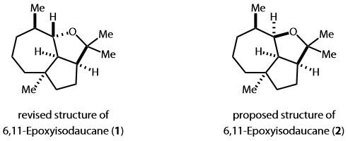</div>

接下来笔者将演示利用DP4+区分这一对非对映异构体。首先在个人电脑上利用ChemDraw结合Chem3D的方式生成rev_eid.mol和pps_eid.mol文件，分别对应修正结构（**1**）和原始推测结构（**2**）。再将这两个.mol文件传输至服务器上DP4+计算模块文件夹DP4plus中，打开终端，运行`x2xyz.sh`，即可生成rev_eid.xyz和pps_eid.xyz。最终运行`./DP4plus`，弹出窗口如下图所示，选择输出文件压缩包的位置后点击OK：

<div align=center>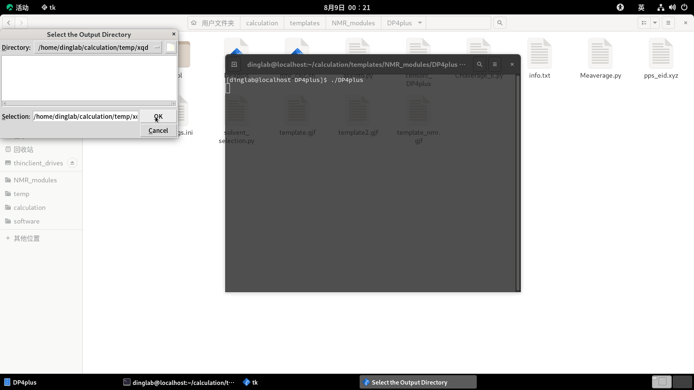</div>

弹出窗口如下图所示，输入输出文件压缩包的名称以及用于接收提醒邮件的电子邮箱地址后点击Start Calculation：

<div align=center>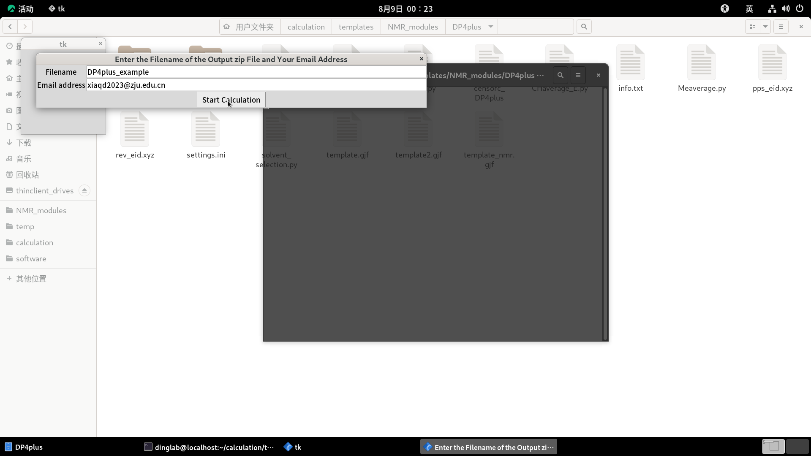</div>

命令行要求选择并行任务数，选择完毕后按下回车：

<div align=center>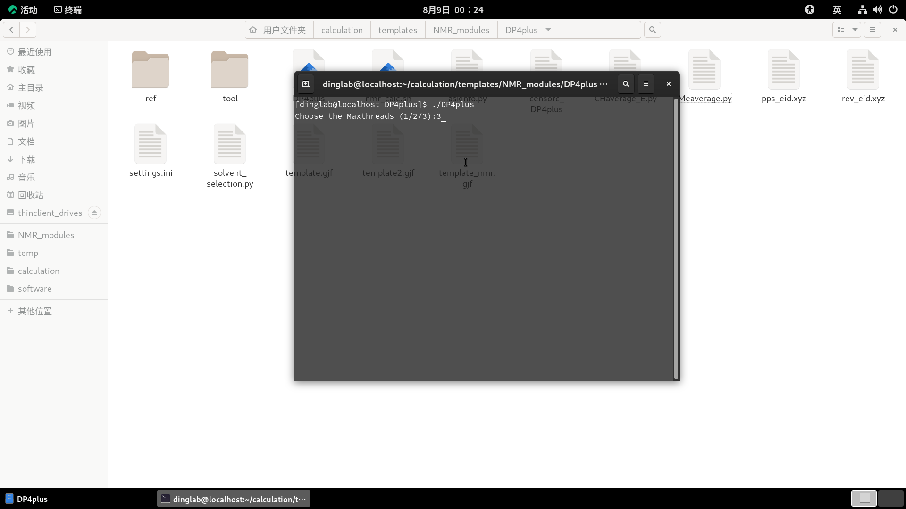</div>

弹出窗口如下图所示，选择溶剂benzene后按下OK，计算开始自动进行：

<div align=center>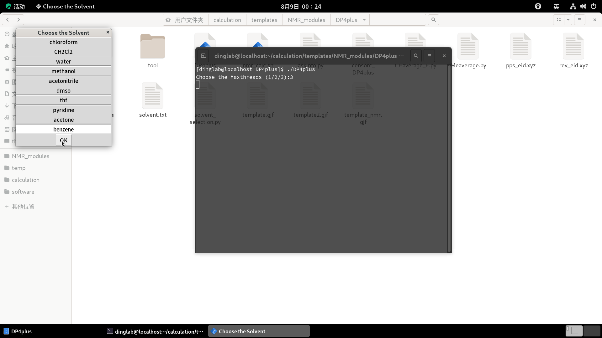</div>

计算完毕，收到邮件提醒：

> ```
> DP4+ Calculation Done!
> 
> The calculation task has been completed, and the output file DP4plus_example.zip has been stored in the directory /home/dinglab/calculation/temp/xqd.
> Used time: from 2026年 08月 09日 星期日 00:24:36 CST to 2026年 08月 09日 星期日 00:41:32 CST
> ```

可见任务耗时约为17 min，可关闭终端，进入输出压缩文件的位置，复制压缩文件至个人电脑后解压，准备处理数据：

<div align=center>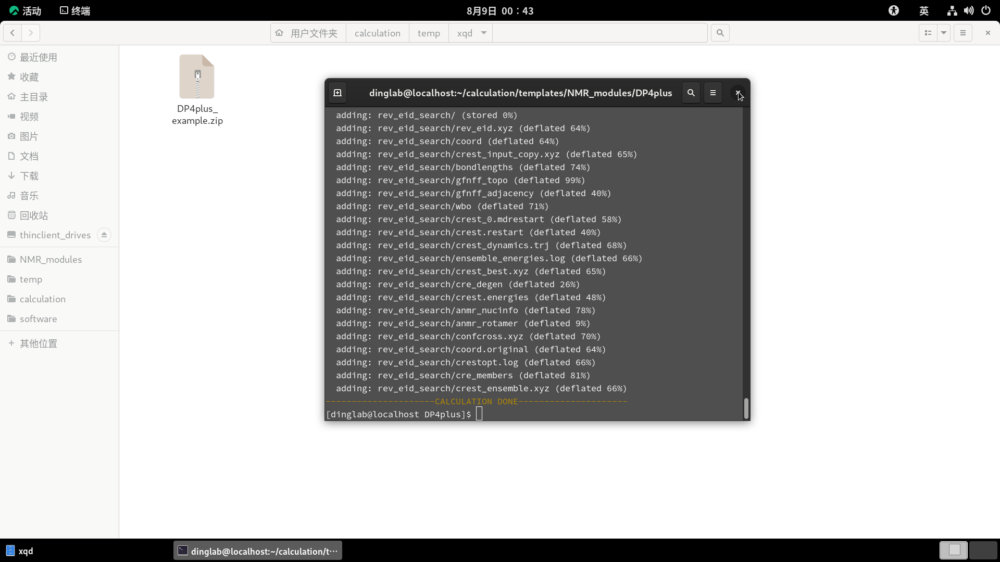</div>

在个人电脑上安装DP4plus-App用于处理数据，安装见[https://github.com/Sarotti-Lab/DP4plus-App](https://github.com/Sarotti-Lab/DP4plus-App)。笔者发现新版本的DP4plus-App识别文件名疑似存在BUG，此处建议安装0.2.8版本。首先将XXX_batch/nmr文件夹中的.out文件复制到同一目录下，运行DP4plus-App，调整相应的计算级别，点击NMR，选择该目录，结果如下图所示：

<div align=center>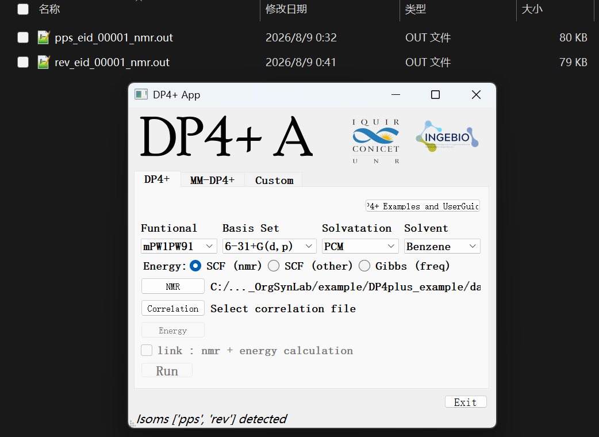</div>

注意到程序判断不同异构体的方式为识别前缀，因此不同的异构体在文件命名时应当在前缀进行区分。

接下来需要创建记录实验数据与关联原子编号的.xlsx文件，其格式规范见[https://github.com/Sarotti-Lab/DP4plus-App](https://github.com/Sarotti-Lab/DP4plus-App)，结果如下图所示：

<div align=center>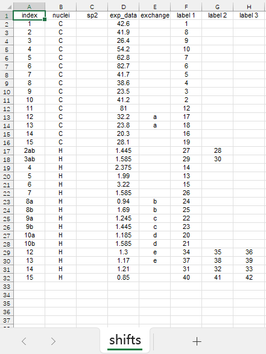</div>

此处exchange列中同一字母标记的为比较时可交换的一对原子，例如CH<sub>2</sub>上不等价的的氢、偕二甲基的碳氢等。标记为可交换的原子的化学位移在比较时自动按计算数据大小顺序进行匹配。若多个候选结构编号不一致时，可额外创建label 1、label 2、label 3三列，输入相应的另一套编号，对应次序与程序识别次序一致。建议同一批候选结构在生成3D结构时基于ChemDraw绘制的同一个结构，避免在此繁琐地逐个对照编号。原子编号可通过GaussView程序打开最初的.mol文件或输出文件中的.gjf文件进行查看。

点击Correlation，选择新创建的.xlsx关联文件，点击Run，目录下生成DP4plus_results.xlsx文件并自动打开，结果如下图所示：

<div align=center></div>

此处只需关注蓝色框中数据，可见结构（**1**）对应的基于氢化学位移、碳化学位移以及综合两者下的DP4+概率均为100%，即DP4+可以判断出天然产物的真实结构应当为（**1**）。

注意到合成课题组亦提供了合成的分离文献推测结构（**2**）的谱图数据，重新创建相应的.xlsx关联文件，重复上述操作，结果如下图所示：

<div align=center>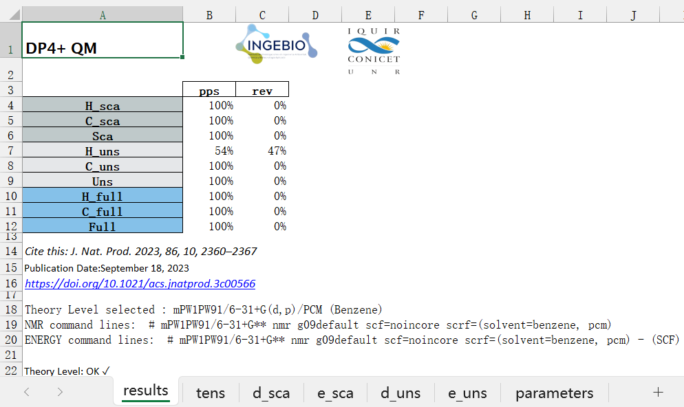</div>

此时结构（**2**）的各项DP4+概率变为100%，故DP4+可以精准地区分这一对非对映异构体。

数据处理亦可通过使用DP4plus/tool文件夹中的Excel计算器手动完成，其使用说明见[https://doi.org/10.1021/acs.joc.1c00987](https://doi.org/10.1021/acs.joc.1c00987)，所需的构象平均后的磁屏蔽常数数据可从在XXX_result文件夹中的XXX_result.txt文本文件中获取。

#### 6.2 MM-DP4+

MM-DP4+的相应操作与DP4+完全类似，进入MM-DP4+计算模块文件夹MM_DP4plus，同样使用上述rev_eid.xyz和pps_eid.xyz作为输入文件，打开终端，运行`./MM_DP4plus`，计算耗时约为15 min。由于该体系的构象数目较少，MM-DP4+在计算效率上相较DP4+未展示出显著优势。

同样使用DP4plus-App处理数据，于MM-DP4+选项下调整相应的计算级别，重复类似操作，结果如下图所示：

<div align=center>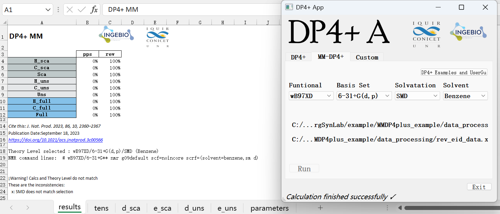</div>

可见MM-DP4+亦可以判断出天然产物的真实结构应当为（**1**）。此处程序警告计算级别不匹配为识别错误，可忽略。此外，处理数据前需进入DP4plus-App程序所在目录，打开data_base_MM.xlsx文件，将子表表名”Bezene“更正为”Benzene“，避免程序报错。

类似地，数据处理亦可通过使用MM_DP4plus/tool文件夹中的Excel计算器手动完成。

#### 6.3 dJ-DP4

合成化学家在修正天然产物6,11-epoxyisodaucane的结构时，修正手性中心处的氢的耦合常数起到了重要的指示作用，笔者继续使用该算例演示利用dJ-DP4对这一对非对映异构体的区分。类似地，进入dJ-DP4计算模块文件夹dJ_DP4，同样使用rev_eid.xyz和pps_eid.xyz作为输入文件，打开终端，运行`./dJ_DP4`，此时无选择溶剂环节，计算耗时约为19 min。

构象平均后的磁屏蔽常数数据可从在XXX_result文件夹中的XXX_result.txt文本文件中获取：

<div align=center>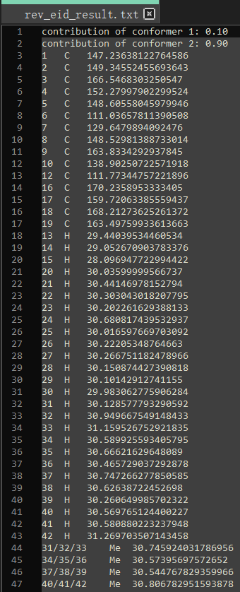</div>

此处标注Me的行表示甲基氢的磁屏蔽常数。

构象平均后的耦合常数矩阵可从XXX_result文件夹中的XXX_J_result.csv文件中获取：

<div align=center>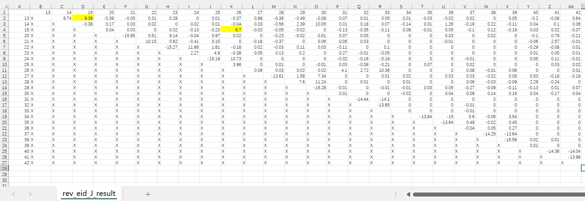</div>

此处矩阵元表示两个相应编号的氢原子间的耦合常数，此例中关注的一对耦合常数已用黄色高亮。

数据处理需通过dJ_DP4/tool文件夹中的Excel计算器手动完成，其使用说明见[https://doi.org/10.1021/acs.orglett.9b01193](https://doi.org/10.1021/acs.orglett.9b01193)，结果如下图所示：

<div align=center>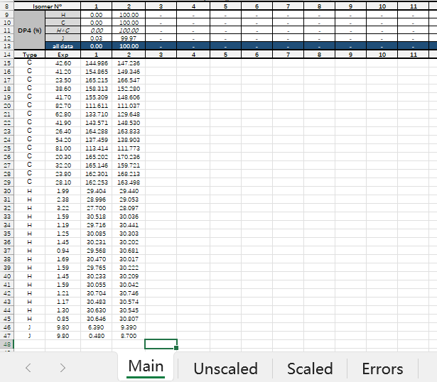</div>

此处，第1列对应分离文献推测结构（**2**），第2列对应修正结构（**1**），可见dJ-DP4可以判断出天然产物的真实结构应当为（**1**）。注意到即使不考虑碳氢的化学位移，仅比较特征的耦合常数，修正结构（**1**）明显与实验数据更吻合。

#### 6.4 ML-J-DP4

进入ML-J-DP4计算模块文件夹ML_J_DP4，同样使用rev_eid.xyz和pps_eid.xyz作为输入文件，打开终端，运行`./ML_J_DP4`，计算耗时约为4 min，相较dJ-DP4计算效率显著提高。

在个人电脑上安装ml-jdp4程序以用于处理数据，安装见[https://github.com/Sarotti-Lab/ML_J_DP4](https://github.com/Sarotti-Lab/ML_J_DP4)。尽管标准安装流程要求Python版本高于3.8即可，但事实上安装时会提示其默认的名为”sklearn“的依赖包名称已废止，新的名为“scikit-learn”的依赖包需要Python版本高于3.9，因此为顺利安装该数据处理程序，Python版本实际应当高于3.9。将ML_J_DP4/tool文件夹中的ml-jdp4-1.3.2.tar.gz压缩包复制到个人电脑上，解压并修改其中setup.py脚本中”sklearn“为“scikit-learn”，随后在setup.py所在目录下打开cmd，运行`python setup.py install`以完成安装。

首先将XXX_batch/nmr文件夹中的.out文件复制到同一目录下，创建记录实验数据与关联原子编号的.xlsx文件，其格式规范见[https://github.com/Sarotti-Lab/ML_J_DP4](https://github.com/Sarotti-Lab/ML_J_DP4)，结果如下图所示：

<div align=center>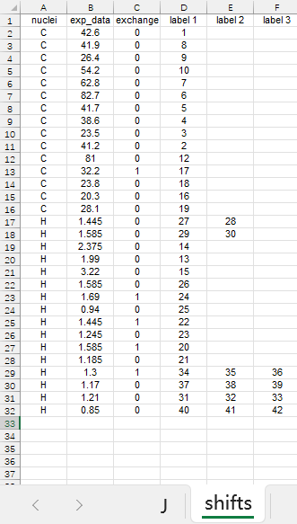</div>

<div align=center>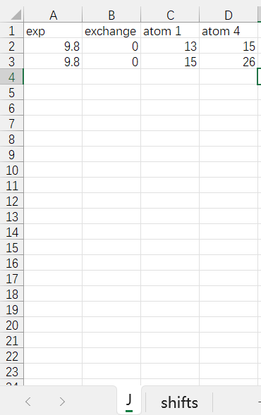</div>

此处exchange列标“1”表明该项与其下一项可交换，这两项的exp_data需按降序排列；耦合常数仅限C(sp<sup>3</sup>)–H之间的<sup>3</sup>*J*耦合常数。

打开cmd，运行`ml_jdp4`，弹出窗口分别选择上述目录和新创建的.xlsx关联文件，程序处理完毕后目录下生成Results_ML_J_DP4.xlsx文件，打开后结果如下图所示：

<div align=center>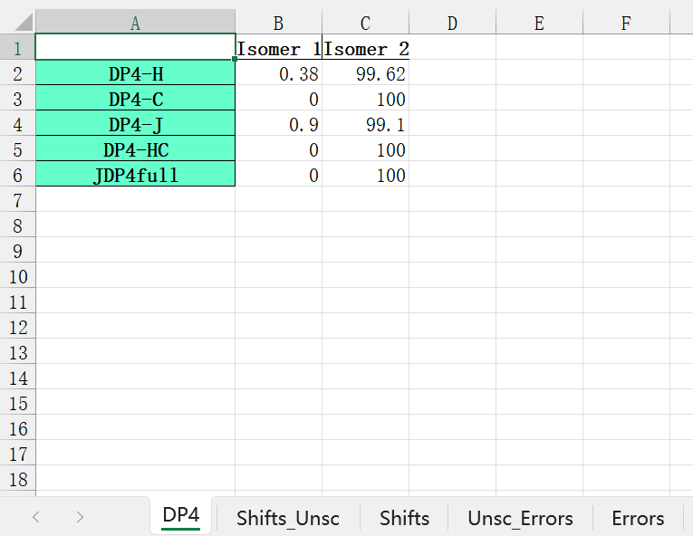</div>

此处，Isomer 1对应分离文献推测结构（**2**），Isomer 2对应修正结构（**1**），对应次序与.out文件的前缀一致，可见ML-J-DP4亦可以判断出天然产物的真实结构应当为（**1**）。

#### 6.5 ANN-PRA-2013

2021年，南开大学鲁照永课题组完成了天然产物Dysiberbol A的全合成并意外修正了其结构（*Angew. Chem., Int. Ed.* **2021**, *60*, 13807.）。分离文献推测结构为（**3**），而修正结构应为脱水醚化后的结构（**4**）。

<div align=center>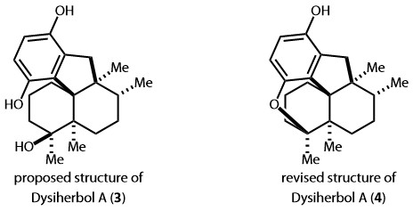</div>

接下来笔者将演示利用ANN-PRA-2013区分这一对结构。进入ANN-PRA-2013计算模块文件夹ANN_PRA_13，通过类似的方式生成pps_dysA.xyz和rev_dysA.xyz输入文件，打开终端，运行`./ANN_PRA_13`，计算耗时约为19 min。

数据处理需通过ANN_PRA_13/tool文件夹中的Excel计算器完成，其使用说明见[https://doi.org/10.1039/c3ob40843d](https://doi.org/10.1039/c3ob40843d)，具体结果如下图所示：

<div align=center>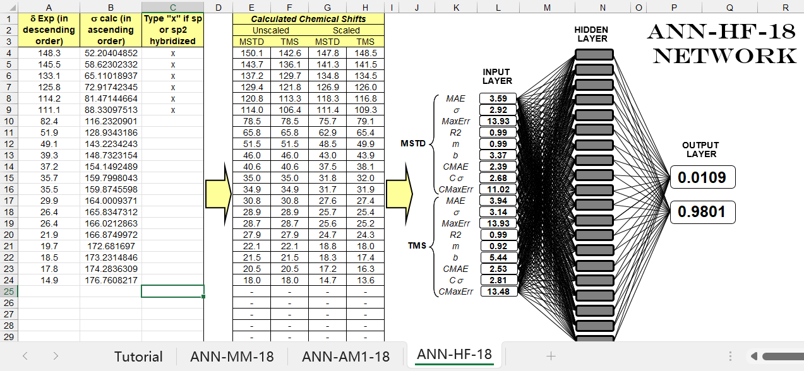</div>

<div align=center>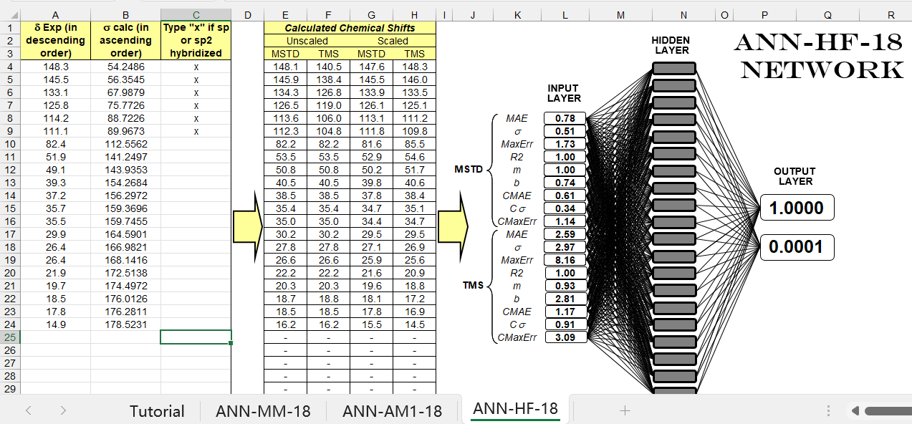</div>

若候选结构骨架有误，则指认过程毫无意义，此处填写数据时编号不需要对应，化学位移实验值按降序排列，计算的磁屏蔽常数值按升序排列。结果“10”指示结构正确，“01”则指示结构错误，中间值无概率意义，不可比较和解读。上图对应分离文献推测结构（**3**）与实验数据比较的结果，下图对应修正结构（**4**）的相应结果，可见ANN-PRA-2013可明确判断分离文献推测的原始结构有误，天然产物的真实结构应为（**4**）。

#### 6.6 ANN-PRA-2015

在此基础上，可以利用区分能力更强的ANN-PRA-2015验证这一结果（该方法仅限氯仿溶剂体系）。进入ANN-PRA-2015计算模块文件夹ANN_PRA_15，同样使用pps_dysA.xyz和rev_dysA.xyz作为输入文件，打开终端，运行`./ANN_PRA_15`，计算耗时约为78 min，相较ANN-PRA-2013明显增加。

类似地，数据处理需通过ANN_PRA_15/tool文件夹中的Excel计算器完成，其使用说明见[https://doi.org/10.1021/acs.joc.5b01663](https://doi.org/10.1021/acs.joc.5b01663)，具体结果如下图所示：

<div align=center>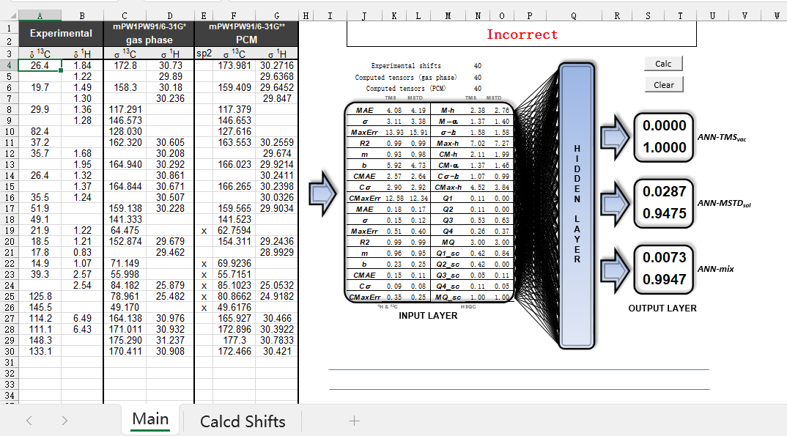</div>

<div align=center>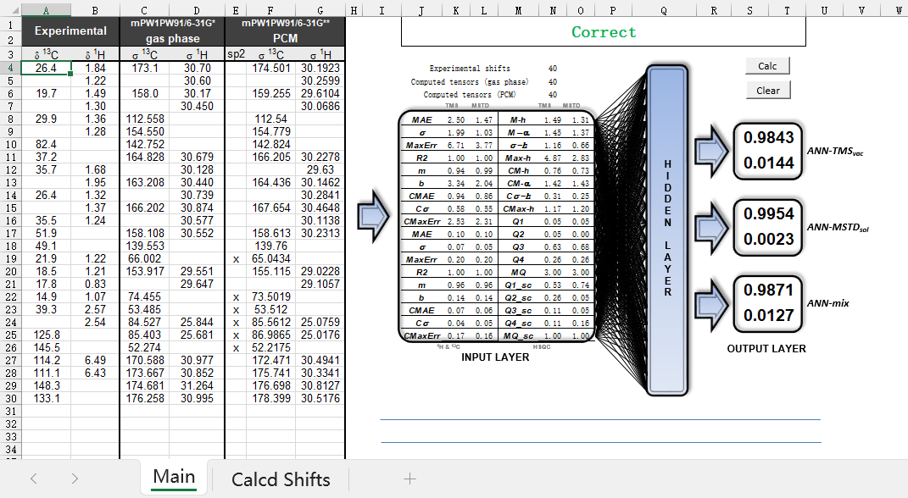</div>

此处填写数据时编号不需要对应，无升降序排列限制，但是需要处理两组计算数据，可从在XXX_result文件夹中的XXX_result_gas.txt和XXX_result_sol.txt文本文件中获取，且需要按标准格式指明CH连接关系，不考虑活泼氢。上图对应分离文献推测结构（**3**）与实验数据比较的结果，下图对应修正结构（**4**）的相应结果，可见ANN-PRA-2015亦可以得出相同的结论。

#### 6.7 autohnmr

2022年，北京大学贾彦兴课题组在天然产物Principinol C的全合成过程中，酮酯（**5**）在DIBAL-H的还原下可生成二醇（**6**）和（**7**），其立体化学均由X-射线单晶衍射确认（*J. Am. Chem. Soc.* **2022**, *144*, 20196.）。

<div align=center>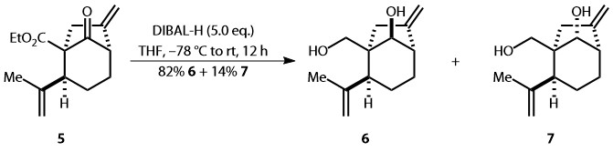</div>

接下来笔者将演示利用autohnmr区分这一对非对映异构体。进入autohnmr计算模块文件夹autohnmr，生成beta_diol.xyz和alpha_diol.xyz输入文件，分别对应二醇（**6**）和（**7**），打开终端，运行`./autohnmr`，计算耗时约为206 min。


#### 6.8 STS

2024年，日本名古屋大学Satoshi Yokoshima课题组实现了天然产物Melognine的推测结构的全合成（*J. Am. Chem. Soc.* **2024**, *146*, 9526.）。合成课题组通过二维谱图确证合成得到分离文献推测结构（**8**），但未明确胺氧化物的氮手性中心的立体化学。

<div align=center>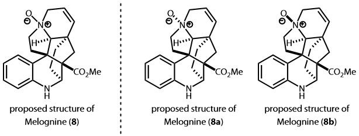</div>

接下来笔者将演示利用STS确认这一氮手性中心的立体化学。进入STS计算模块文件夹STS，生成alpha_melo.xyz和beta_melo.xyz输入文件，分别对应结构（**8a**）和（**8b**），打开终端，运行`./STS`，指定的输出文件压缩包的位置和名称以及用于接收提醒邮件的电子邮箱地址，选择并行任务数，此时命令行要求选择溶剂，选择chloroform后按下回车：

<div align=center>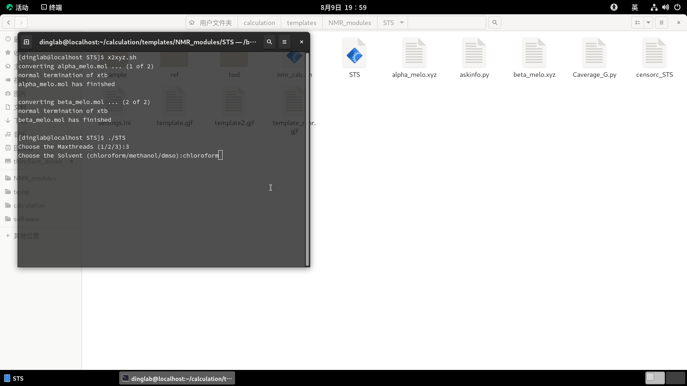</div>

计算耗时约 min。数据处理需通过STS/tool文件夹中的Excel计算器完成，其使用说明见[https://doi.org/10.1021/acs.joc.0c01451](https://doi.org/10.1021/acs.joc.0c01451)，具体结果如下图所示：


###  **结语**

